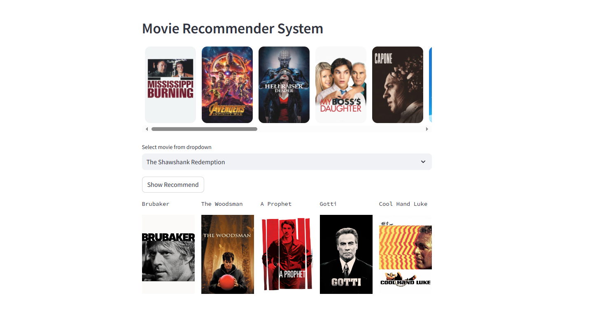

# Movie Recommendation System

## Project Overview
The Movie Recommendation System is a content-based filtering system that recommends movies to users based on their preferences and the similarity of movie content. It solves the problem of helping users discover new movies that align with their interests and preferences.

## Case Study
Coming Soon

## Technical Details
The recommendation system in this project is based on the concept of content-based filtering. This approach recommends items by comparing the content of the items to a user profile. The content of each item is represented as a set of descriptors, such as the words in a document. The user profile is represented with the same descriptors.

Here's a step-by-step explanation of how the system works:

1. **Preprocessing**: The system first preprocesses the movie data to extract or create meaningful features.

2. **Vectorization**: Each movie is then represented as a vector in a multi-dimensional space. 

3. **Similarity Matrix Calculation**: The system calculates the similarity between every pair of movies using a similarity measure such as cosine similarity. The result is a similarity matrix where the cell in the i-th row and j-th column is the similarity score between the i-th movie and the j-th movie.

4. **Recommendation**: When a user selects a movie, the system looks up the corresponding row in the similarity matrix. It then sorts the movies based on the similarity scores and recommends the movies with the highest scores.

This approach assumes that if two movies are similar in content, they are likely to be of interest to the same users. Therefore, if a user likes a particular movie, they are likely to also enjoy movies that are similar to it.

## Data Source
The movie data used in this project is sourced from the [Top Rated TMDB Movies 10k dataset](https://www.kaggle.com/datasets/ahsanaseer/top-rated-tmdb-movies-10k).

## Dependencies
This project uses the following Python packages:

- `streamlit`: This package is used to create the web application interface.
- `pickle`: This package is used to serialize and deserialize Python object structures. In this case, it's used to load the movie data and the similarity matrix from pickle files.
- `requests`: This package is used to send HTTP requests. In this case, it's used to fetch movie posters from an API.

## Installation
1. Clone this repository.
2. Install the necessary Python packages. You can do this by running `pip install -r requirements.txt` in your terminal.
3. To gain access to the pkl.txt file, you may need to run the IPython Notebook (.ipynb) files. Running these files will allow you to execute the necessary code and generate the pkl.txt file. Once generated, you can then access and utilize the pkl.txt file for further processing or analysis.

## Usage
1. Run the Streamlit app with the command `streamlit run app.py`.
2. In the app, select a movie from the dropdown menu.
3. The app will display a list of movies that are similar to the selected movie.

## Screenshots

## Contact Information
You can reach me on [LinkedIn](https://www.linkedin.com/in/vahe-aslanyan/) if you have any questions or would like to contribute to the project.

## License
[MIT](https://choosealicense.com/licenses/mit/)
